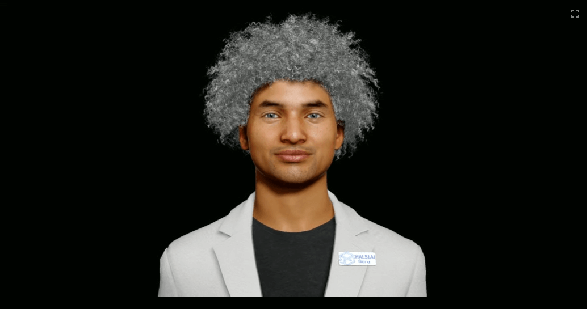

# Soul Machines Avatar
Create an avatar you can chat with on your lemurbox using soul machines.

# Developer Instructions
1. First make an account with [soul machines](https://www.soulmachines.com/), create an avatar and create an API key
2. Rename `.env.example` to `.env` and fill out `VITE_SM_API_KEY` to your api key created in step 1
3. Run `npm install`
4. Run `npm run dev` to start your server.

## Usage

### Connecting to the Avatar

Press the **Connect** button to initialize the avatar session. The JavaScript in [main.js](./main.js) handles the connection and starts the video feed.

### User Interactions
* __Full Screen Mode__: Click the full screen button to toggle out of or into full screen.
* __Toggle Audio__: Clicking on the video element stops any ongoing speech and toggles the microphone state.

# Troubleshooting

### API Key Errors:

Ensure your API key in `.env` matches a valid key from your Soul Machines account.

### Media Device Access:
If you experience issues with audio or video, check if your browser is blocking access to your microphone or camera.

# Additional Information
### Styling and Layout:
The layout is controlled via [style.css](./style.css), where you can adjust positioning and theming (e.g., background color).

### API Endpoint Adjustments:
  If you need to point to a different API endpoint or stage the environment (development vs. production), update the endpoint values in your `.env` file.